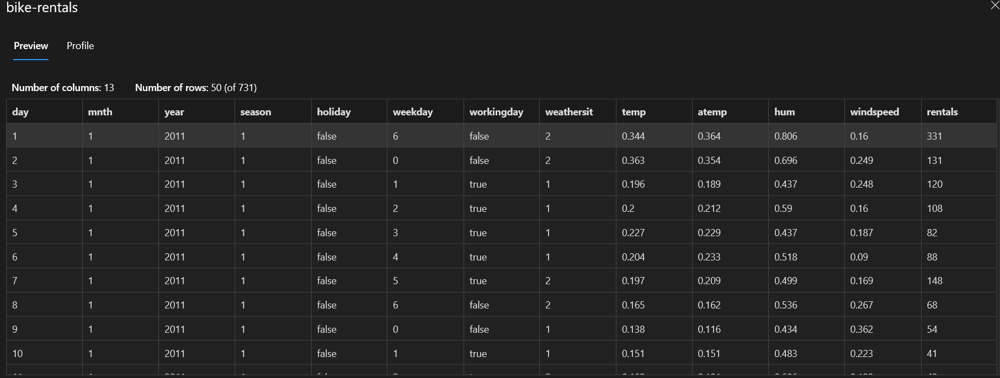
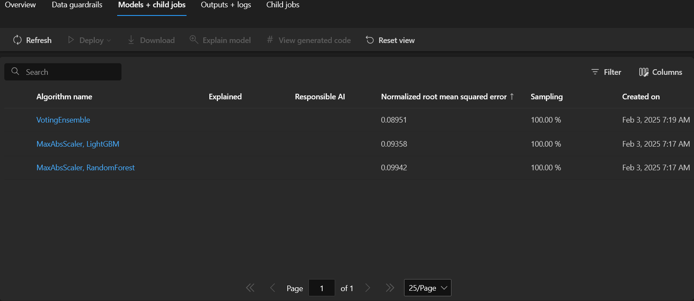
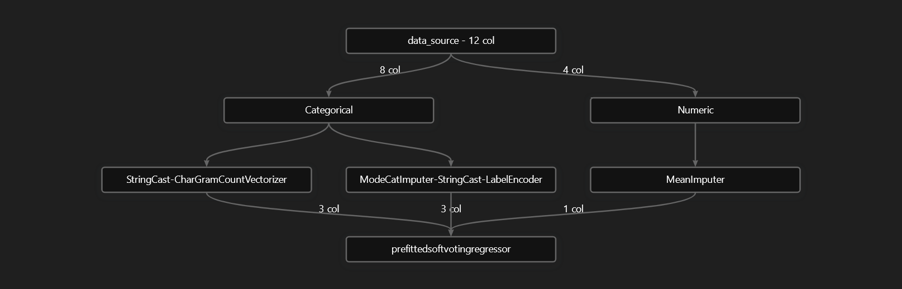
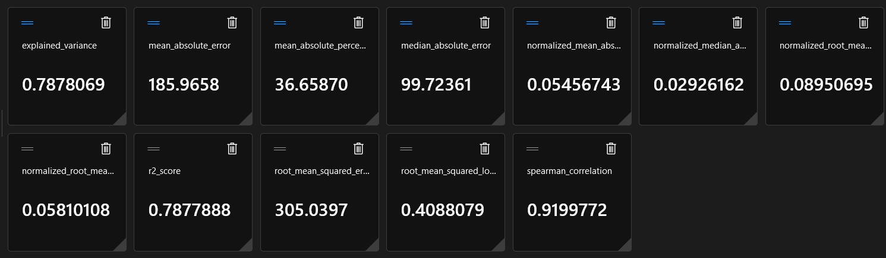
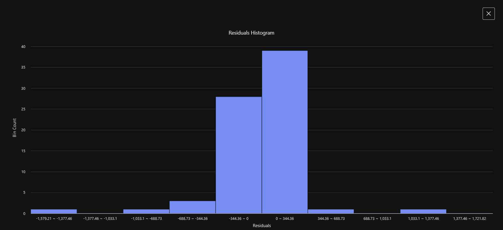
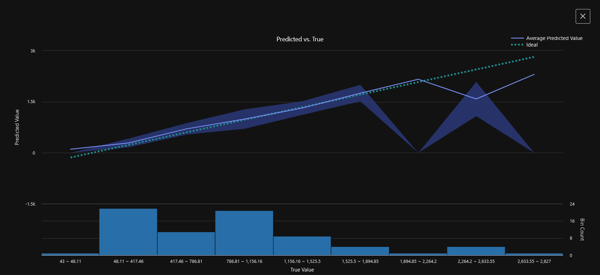

# Azure Machine Learning
> Challenge created as part of the Microsoft AI Fundamentals Bootcamp by DIO, based on the [Explore Automated Machine Learning in Azure Machine Learning](https://aka.ms/ai900-auto-ml) tutorial.

## Automated ML: Step-by-Step Guide 
This guide outlines the process of using Automated Machine Learning (AutoML) in Azure Machine Learning to train and deploy a regression model using the `bike-rentals` dataset.

### 1. Provision an Azure Machine Learning Workspace
- Start by provisioning an Azure Machine Learning workspace in the Azure portal.

- Search for *Machine Learning* in the Azure portal and create a new Azure Machine Learning resource.

- Navigate to the Azure Machine Learning Studio to manage your machine learning resources.

- In Azure Machine Learning Studio, select the *Automated ML* option.

- Set a descriptive name and description for your job.

- Choose the task type. For this project, select **Regression**.

### 2. Choose the Dataset
- Use the `bike-rentals` dataset, which is available [here](https://aka.ms/bike-rentals).

 

### 3. Configure Task Settings
- Adjust the task settings, including:
    - Metric definitions
    - Allowed models
    - Limits and settings for validation and testing 

```
Task settings:

    Task type: Regression
    Dataset: bike-rentals
    Target column: rentals (integer)
    Additional configuration settings:
        Primary metric: NormalizedRootMeanSquaredError
        Explain best model: Unselected
        Enable ensemble stacking: Unselected
        Use all supported models: Unselected. You’ll restrict the job to try only a few specific algorithms.
        Allowed models: Select only RandomForest and LightGBM — normally you’d want to try as many as possible, but each model added increases the time it takes to run the job.

    Limits: Expand this section
        Max trials: 3
        Max concurrent trials: 3
        Max nodes: 3
        Metric score threshold: 0.085 (so that if a model achieves a normalized root mean squared error metric score of 0.085 or less, the job ends.)
        Experiment timeout: 15
        Iteration timeout: 15
        Enable early termination: Selected

    Validation and test:
        Validation type: Train-validation split
        Percentage of validation data: 10
        Test dataset: None
```

### 4. Set Compute Characteristics
- Configure the compute settings for model training as shown below:

```
Compute:

    Select compute type: Serverless
    Virtual machine type: CPU
    Virtual machine tier: Dedicated
    Virtual machine size: Standard_DS3_V2*
    Number of instances: 1
```

### 5. Submit the Training Job
- After configuring the settings, submit the training job to begin the model training process.

### 6. Trained Models
- Once the AutoML job is complete, review the best model trained by the system.

- In this training, three models were generated:
    - VotingEnsemble
    - LightGBMRegressor
    - Random Forest

 

### 7. Identify the Best Model
- The best model was the `VotingEnsemble`, which had the best training performance.

### 8. Review the Data Transformation
- The following diagram illustrates the data preprocessing, feature engineering, scaling techniques and the machine learning algorithm that Automated ML applied to generate this particular model.

 

### 9. Review Model Metrics
- In the *Metrics* tab, you can view all metrics related to the trained model and the data processing:



### 10. Analyze Residuals
- The *Residuals* graph shows the distribution of errors made by the model:



### 11. Compare Predicted vs. True Values
- The graph below compares the predicted values with the true values from the test set:


<div align="center">Comparation of predicted and true values graphs</div>

### 12. Deploy the Best Model
- With the best model selected, you can deploy it. In this tutorial the `Real-time endpoint` option was used to deploy the model.

### 13. Test the Deployed Model
- Once the deployment is complete, you can test the model by sending requests to the `Real-time endpoint`.

### 14. Input Data for Testing
- To test the endpoint, replace the sample JSON input with your own data. Below is an example of the input used:

Input:

``` 
{
    "input_data": {
        "data": [
            {
                "day": 1,
                "mnth": 1,
                "year": 2022,
                "season": 2,
                "holiday": 0,
                "weekday": 1,
                "workingday": 1,
                "weathersit": 2,
                "temp": 0.3,
                "atemp": 0.3,
                "hum": 0.3,
                "windspeed": 0.3
            }
        ]
    },
    "GlobalParameters": 1.0
}
```

### 15. Output

```
[
  353.571393707175
]
```
### 16. Model Summary
- In summary, this model predicts the number of bicycle rentals on a given day based on features such as season, weather, temperature, humidity, and time of day.